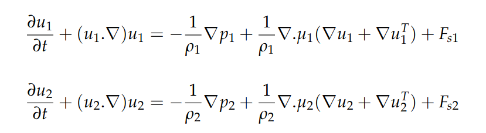
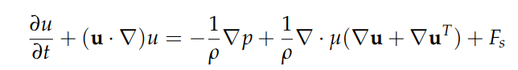

  

  

# Numerical Modeling of Bifluid Flows on Quadtrees

## Context

## Equations of the Model
In a two-fluid model, each fluid, caracterised by its own density ρ and velocity μ, satisfies the Navier-Stokes system equation:

  

In one single problem, a unique momentum equation can be writen on new variables ρ and μ: 

  

where (ρ,μ) become a function that is equal to (ρ₁,μ₁) in the first fluide and to (ρ₂,μ₂) in the second. In order to model the interface Γ
between fluids, the boundary is considered as the zero level of a function φ called LevelSet where:

  

## Algorithm of the prediction-correction method