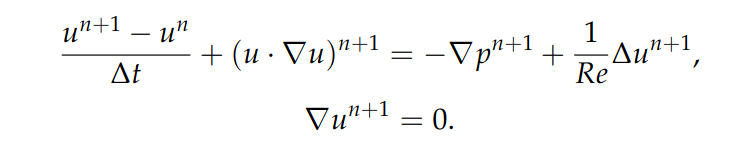

  

  

# Numerical Modeling of Bifluid Flows on Quadtrees

## Context

## Equations of the Model
In a two-fluid model, each fluid, caracterised by its own density ρ and viscosity μ, satisfies the Navier-Stokes system equation:

  

A unique momentum equation can be writen on new variables ρ and μ in order to model one single problem: 

  

where (ρ,μ) become a function that is equal to (ρ₁,μ₁) in the first fluide and to (ρ₂,μ₂) in the second. To model the interface Γ
between fluids, the boundary is considered as the zero level of a function φ called LevelSet where:

  

The LevelSet is updated at each iteration of the calculation through the resolution of the following Transport equation:

  

Initially, LevelSet is choosen as the signed distance function to the interface

  

The reconstruction of values ρ and μ from the LevelSet is done after updating, as follows:

  

## Algorithm of the prediction-correction method
A way to solve the Navier-Stokes equation:

  

and find the value of velocity at the next time tⁿ⁺¹ is to use the prediction-correction method which consists of the following parts:

### Predction Step:
The method starts with solving the prediction equation and fiding the value of the intermediate velocity u* defined as follows:  

  

### Poisson equation:
By knowing the value of the u*, the value of ψ is found thanks to Poisson equation which can be writting in the following form:

  

