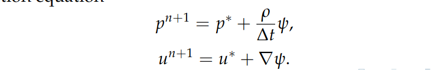

  

# Numerical Modeling of Bifluid Flows on Quadtrees

## Context
### Definiton of a Bi-fuid Flow
Bifluid flow involves the concurrent movement of two distinct fluids within a single conduit, maintaining their unique properties. It's crucial in understanding complex dynamics in systems like pipelines and heat exchangers, where interactions such as velocity differences and interfacial behavior play significant roles.

### Objective of the Project
The main objective of the project is to develop a bi-fluid Navier-Stokes numerical model using quadtree mesh in two dimensions based on existing foundational components in NEOS, including gradient computation and Poisson problem solutions.

## Environment
### The NEOS Library 
This following work is based on NEOS, a C++ coded library developed by the Inria MEMPHIS team. NEOS is designed with various differential operators discretized by finite volumes on quadtree meshes in 2D (and octrees in 3D). Additionally, NEOS is capable of massively parallel computing using MPI.
### The Quadtree Meshes
The quadtree is a highly efficient structure that operates on the principle of recursive spatial subdivision, which involves breaking down a space into smaller, more manageable units for analysis. At the heart of its design, each node in a quadtree represents a specific spatial region. This region is then subdivided into four smaller regions, allowing for more detailed analysis and efficient data retrieval. One of the key properties of a quadtree is its spatial indexing capability, which, combined with its adaptability to various scales of spatial data, makes it an invaluable tool in areas such as geographic information systems, image processing, and computer graphics.
### Advantages of Quadtree Meshes
Quadtrees are exceptionally useful in simulations due to their ability to provide adaptive mesh refinement. This feature allows for increased detail in specific regions of interest within a simulation, thus enhancing accuracy where it is most crucial. In addition to this, quadtrees facilitate efficient storage and retrieval of spatial data. This optimization of computational resources significantly reduces processing time, making these structures highly effective. Furthermore, they excel in representing complex 2D and 3D geometries, which is essential for accurately modeling physical spaces in simulations, thereby ensuring a high level of precision and reliability in the simulated environment.

## Equations of the Model
In a two-fluid model, each fluid is distinct and has its own unique properties, specifically density (ρ) and viscosity (μ). These fluids adhere to the principles of the Navier-Stokes equations.This model can be expressed through the following formulation:

  

A single momentum equation can be formulated using the new variables ρ and μ to represent and solve a unified problem:

  

n this model, (ρ, μ) are functions that vary depending on the fluid. Specifically, they equal (ρ₁, μ₁) in the first fluid and (ρ₂, μ₂) in the second. To accurately represent the interface Γ between these two fluids, the boundary is defined as the zero level of a function φ, known as the LevelSet, where:

  

The LevelSet is dynamically updated at each step of the computation by solving the subsequent Transport equation:

  

Initially, the LevelSet is chosen to be the signed distance function relative to the interface:

  

Subsequently, the values of ρ and μ are reconstructed from the LevelSet after being updated using the following method:

  

## Algorithm of the prediction-correction method
The approach used to solve the Navier-Stokes equation and determine the velocity value at the next time step, tⁿ⁺¹, involves utilizing the prediction-correction method. This method is composed of the following parts:

### Prediction Step:
The method begins by solving the prediction equation to find the value of the intermediate velocity u∗, which is defined as follows: 

  

### Poisson Squation:
Having determined the value of u∗, the value of ψ is then computed using the Poisson equation, which can be expressed in the following form:

  

### Correction Step:
The velocity value uⁿ⁺¹  at time tⁿ⁺¹ is ultimately derived from the correction equation as follows: 

  

